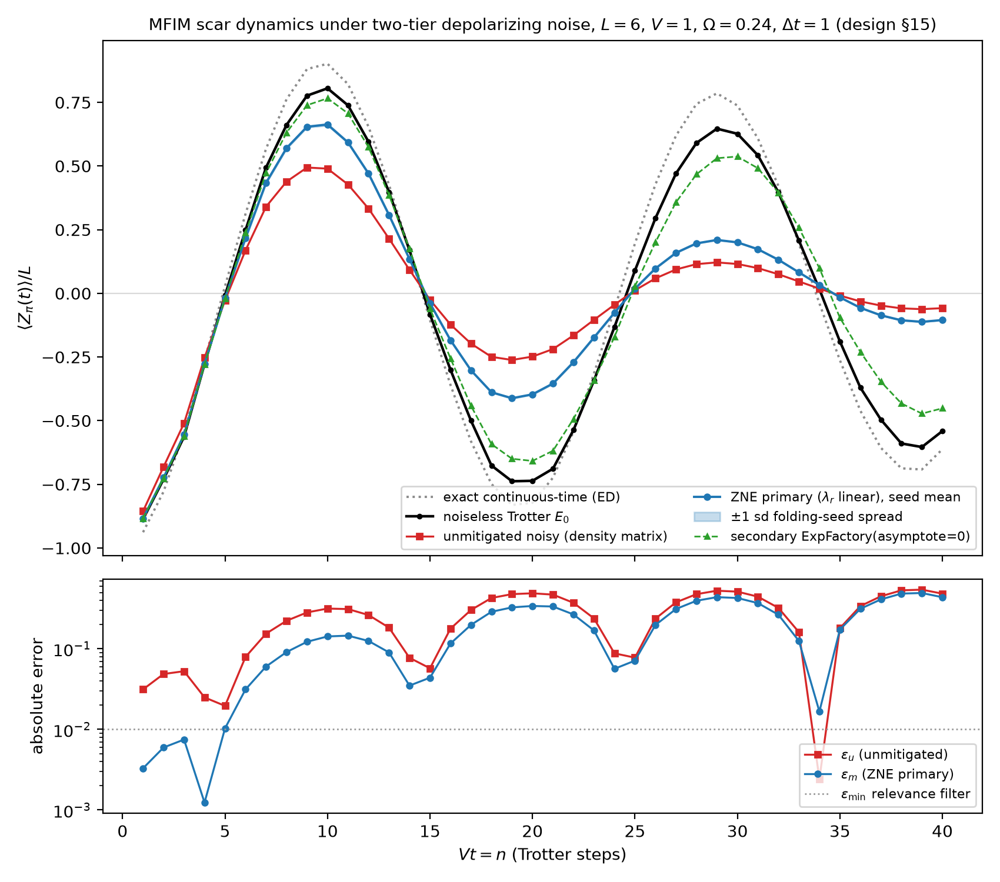

# zne-many-body-scars

A simulation-only study of zero-noise extrapolation (ZNE) applied to quantum
many-body scar dynamics in the mixed-field Ising model (MFIM). The completed
Phase 1 experiment was executed in the pinned Python environment recorded in
`results/minimal/environment.json`. The Phase 2 material has not been executed as
a study, and its feasibility remains unassessed. Nothing in this repository runs
on quantum hardware.

The repository has three parts:

1. **Phase 1, completed evidence.** A pre-registered minimal experiment at
   $L = 6$ was run once under `docs/design.md` and reproduced twice on the same
   machine with byte-identical output. Its data are in `results/minimal/`, its
   figure in `figures/`, and its findings in `docs/results-minimal.md`. It is
   published as release v0.1.0 (Zenodo version DOI 10.5281/zenodo.22005535).
2. **Phase 2, an implemented framework.** A preregistration
   (`docs/prereg-phase2.md`), an analysis and output contract
   (`docs/phase2-analysis-contract.md`, `tools/phase2_contract.json`), an
   offline checker (`tools/phase2_contract_check.py`), estimator and bootstrap
   code (`phase2/`) and their tests (`tests/test_phase2_*.py`) exist and pass.
3. **Phase 2 science, not run.** No contracted Phase 2 result exists. No
   feasibility has been assessed. No IBM or other hardware work has been done
   or authorized. Section 5 states exactly what has and has not happened.



## Status at a glance

Status as of 2026-09-08. Release details are in the "Release status" paragraph of section 4.

| Part | Current status | Where to check |
|---|---|---|
| Phase 1 minimal experiment | Finished and published as v0.1.0; documentation updated afterwards ([PR 1](https://github.com/TheMickeyDodger/zne-many-body-scars/pull/1), merged as commit `1da75c8db312888c50d86da71283f3b7fd095fd4`). | `results/minimal/metrics.json`, `docs/results-minimal.md`, `docs/design.md` section 20 |
| Phase 2 framework | Implemented: preregistration, contract, checker (120 offline checks), estimators, bootstrap, tests. Two human-approved pre-data amendments (A-1, A-2) and one correction to A-2 are recorded with file identities in `tools/phase2_contract.json` (`amendments`). | `tools/phase2_contract_check.py`, `tests/test_phase2_*.py`, section 5 |
| Phase 2 science | Not run. No contracted result, figure, interval or verdict exists. Feasibility is unassessed, and the during-run monitoring method carries a documented production NO-GO. A quarantined pilot acquisition (17 of 162 planned work units) did execute the Aer simulator and produce raw records before it was stopped; its values are unused and are not a result. | section 5 |
| Phase 3 | Deferred. Work has not started. | |

### History of the Phase 2 status statements

The lines below are kept as written, each dated, so that earlier statements
can be compared with the current status above. Where an earlier line says
"no data have been collected", it was true on its date and is superseded by
the quarantined-pilot facts in section 5.

- Row as written 2026-09-07 (HISTORICAL): "Preregistered and unexecuted. The design is frozen in `docs/prereg-phase2.md` with its analysis and output contract in `docs/phase2-analysis-contract.md`. No Phase 2 experiment has been run and no data have been collected. No simulator or hardware result exists. No IBM workload has been submitted or authorized; a second human gate is required before any hardware submission. Preregistered means reviewed and frozen, not approved to run."
- Update, 2026-09-08, A-1 (HISTORICAL; written before A-2 and the pilot acquisition): a human-approved, pre-data amendment fixes the Phase 2B exponential-extrapolator rank minimum at three distinct realized abscissas and leaves the Phase 2C minimum at two; the pre-amendment identities are retained in `tools/phase2_contract.json` (`amendments`). An offline Phase 2 environment (`.venv-phase2`, `requirements-phase2.txt`) and scaffolding under `phase2/` exist. No Phase 2 experiment, fit, bootstrap, figure or result exists.
- Update, 2026-09-08, A-2: a second human-approved amendment fixes the exponential-extrapolator sign convention (the pinned NumPy sign of the `numpy.polyfit` intercept, zero included), makes the Phase 2A statistics undefined below three masked steps, and defines the density-matrix companion's seed range (amplitude at the aggregate-matched step, timing per seed in the same window, no partial range). Approval preceded the affected analyses; real Aer timing probes and a separately labelled, quarantined pilot acquisition had already run. Correction, 2026-09-08: after an independent review rejected the first A-2 candidate, the implementation decides every exponential-extrapolator sign with the scalar `numpy.polyfit` call (a guard-band shortcut was removed), computes the exponential log-mode fit with the same pinned weighted `numpy.polyfit` call, and treats every non-finite density-matrix seed value as undefined; the rules themselves are unchanged. Still no contracted Phase 2 result.

### Reproduction evidence for Phase 1

- **Repeated runs on the same machine produced identical files.** All six output files were byte-for-byte identical across three runs with the same pinned environment and hardware (design.md section 16; "Determinism" in section 4 below).
- **The tests pass.** GitHub Actions run [34073032105](https://github.com/TheMickeyDodger/zne-many-body-scars/actions/runs/34073032105) completed successfully on the merge commit. PR 1 records 116 passing tests under Python 3.12.14 with pinned dependencies. The Phase 2 files add further tests; run `pytest` for the live count.
- **The cross-platform comparison failed, and the cause is not yet known.** Run [34063462240](https://github.com/TheMickeyDodger/zne-many-body-scars/actions/runs/34063462240) found 609 values outside the section 16 tolerance of 1e-12: 6 in `steps.csv` and 603 in `seed_arms.csv`. `docs/ci-reproduction-assessment.md` records the result. Neither the tolerance nor the scientific claims were changed.

## 1. The question

Does ZNE reduce the error in $\langle Z_\pi\rangle/L$ for a first-order
Trotter simulation of the one-dimensional MFIM with local depolarizing noise?
The comparison uses the noiseless value of the same circuit. `docs/design.md`
section 1 defines the question and states that a negative result would also
be reported.

## 2. Result of the Phase 1 experiment

Every number in this section is read from a committed file. The summary values
are the fields of `results/minimal/metrics.json`; the per-step values are the
rows of `results/minimal/steps.csv` (40 steps plus a header line). The oracle
comparison is defined in `docs/results-minimal.md` section 9 and can be
recalculated from `steps.csv`.

**The result passes the criterion set in advance** (`verdict_passes: true`).
The global improvement factor, the ratio of the unmitigated to the mitigated
RMS error over the 40-step window (design.md section 13), is GIF = 1.2777
(`gif_value`, equal to `rms_u` / `rms_m`): RMS error falls from 0.32080 without
mitigation (`rms_u`) to 0.25107 with mitigation (`rms_m`).
The improvement factor IF is above 1 on all 39 reportable steps (`if_wins`,
`reportable_steps_m`). Step $n = 34$ is excluded by the $\varepsilon_{\min}$
filter (`excluded_steps`); it is also the only step where ZNE increases the
error (IF = 0.145 in `steps.csv`), when the unmitigated error is already very
small.

Four qualifications matter:

- **The improvement is strongly regime-dependent.** In `steps.csv`, IF peaks at 20.17 at $n = 4$ and decays to about 1.107 by $n = 40$.
- **Much of the improvement comes from restoring amplitude, not from extrapolation.** A post-hoc oracle constant rescale, fitted with access to the exact answer, captures about 68 percent of the primary method's reduction in RMS error (`docs/results-minimal.md` section 9).
- **At late steps no claim is made in either direction.** Both errors saturate toward $|E_0(n)|$ and IF tends to 1; the pre-registered metrics cannot distinguish ZNE failure from the absence of any remaining signal there (design.md section 13).
- **Two discrepancies remain open** (`docs/results-minimal.md` sections 4 and 8). The observed decay is about twice as slow as the design's global-depolarizing estimate. Channel locality may explain this, but the single-qubit contribution is unresolved; a $p_2 = 0$ control is part of the Phase 2 design.

The shot-based secondary pipeline (8192 shots, seeded) independently gives
GIF = 1.2774 and the same 39 of 39 pattern (`shot_pipeline` in `metrics.json`).

### The committed data and figure

| file | what it holds | sha256 |
|---|---|---|
| `results/minimal/metrics.json` | the summary fields quoted above | `7bd42a5261ecdbfbee3573f2a78f78e01aee51a0f93a20f6ba0fa6a8dd332f22` |
| `results/minimal/steps.csv` | 40 per-step rows: unmitigated, mitigated, noiseless reference, errors, IF | `524e99facceba5df9eb27d6534496f2da5c0a6ede948fd4a2c847402101dc58c` |
| `results/minimal/seed_arms.csv` | 320 step-by-seed rows (40 steps x 8 fold seeds) of fitted intercepts: primary, nominal-scale and effective-scale linear intercepts, the exponential secondary in both modes, and the clamp flags, for the density-matrix and shot pipelines | `52c5961db3db818f0ff51e75afa443c20d6dcfdbd41f75987770c3ae2987614a` |
| `results/minimal/shot_values.csv` | 960 seeded shot-pipeline values | `8cca8a6d52dfddafae607c959e024a588c9fa86ef41c8092251f9f2aca8ea42d` |
| `results/minimal/folded_circuits.csv` | 960 folded-circuit gate counts (realized scale factors) | `b5d9d79d79ff4dabb859dc755c66ce0b20275dd5eafbed8c06701f1e20947a40` |
| `results/minimal/environment.json` | the recording environment and source identity | `6f4b1053fd9d9b84c40226d29cabb836f91417d25202e3f8148fbcfdbb64be6c` |
| `figures/minimal_experiment.png` | the figure above | `a8098a41468ccd020be943f0ef8644a377798a180abf29e6aded406017d8566c` |
| `figures/minimal_experiment.pdf` | the same figure as PDF | `d248db8c0fbd742f383923bd6e5358df690448ea46d2231025552332ff243e5f` |

**Figure provenance.** Both figure files are generated by
`scripts/make_figures.py` from `results/minimal/steps.csv` alone (command in
section 4, run from the repository root). Regenerating them from the committed
CSV reproduces `figures/minimal_experiment.png` byte for byte (sha256
`a8098a41468ccd020be943f0ef8644a377798a180abf29e6aded406017d8566c`). The PDF
regenerates with identical size (34728 bytes) and identical content; the only
differences lie inside its `/CreationDate` timestamp field, which the PDF
writer stamps at generation time. The committed PDF is therefore content-
reproducible but not byte-reproducible.

## 3. Provenance in brief

The primary source is the paper by Chen, Burdick, Yao, Orth and Iadecola
(section 7), which reports error-mitigated scar dynamics on IBM hardware with
systems up to 19 qubits. The Mitiq documentation provides a simpler simulator
example. This repository uses those sources but runs a separate $L = 6$
simulation with its own design. It neither reproduces the paper's hardware
experiment nor makes claims about hardware performance. `docs/design.md`
section 14 gives the full source comparison and limitations.

## 4. Reproduction of Phase 1

Requirements: Python 3.12.x (mitiq 1.0.0 requires at least 3.11 and below
3.13), network access for the initial install only. All commands are run from
the repository root.

```bash
python3.12 -m venv .venv
.venv/bin/python -m pip install --upgrade pip
.venv/bin/python -m pip install -r requirements.txt   # fully pinned lockfile
.venv/bin/python -m pip install -e .

.venv/bin/python -m pytest -q

# Reproduce the experiment in a new directory. The scripts refuse to write to
# results/minimal/ or figures/ unless explicitly overridden.
.venv/bin/python scripts/run_minimal.py --out results/repro

# Compare the new bundle with the recorded data. See design.md section 16 and
# docs/reproduction-protocol.md for the same-hardware and cross-platform rules.
.venv/bin/python tools/verify_reproduction.py --canonical results/minimal --repro results/repro

# Regenerate the figures from the recorded CSV into a fresh directory
# (figures-repro is the default; the canonical figures/ directory is refused
# without the explicit override flag).
.venv/bin/python scripts/make_figures.py --results results/minimal --out figures-repro
```

Runtime is printed to the terminal but not stored in `results/`, so wall-clock
time cannot affect file comparison; the only recorded wall-clock figure is the
250.3 s full run noted in design.md section 20 (row A2-4), measured once on the
recording machine. Durations in `docs/mutation-evidence.md`
come from the test harness, not the experiment.

**Determinism.** Three runs on the same machine and pinned environment produced
the same six files byte for byte. The source recorded by the original bundle
has hash `7161d655...`. Later changes to write guards, provenance wording and
package metadata changed the source hash but not the five data files; the
expected `environment.json` differences are checked against
`tools/release_identity.json`. Exact byte comparison requires Python 3.12.14
and the same hardware and BLAS build. On a different machine, pass
`--different-hardware` to request the numerical comparison. The cross-platform
tolerance is 1e-12, although the first Linux run failed that comparison. See
design.md sections 16 and 20 for the full rules.

**Release status (2026-09-06)**

- GitHub release `v0.1.0` points to revision `51f55c1` and was published at 2026-08-19T03:40:16Z.
- Zenodo record 22005535 has the version DOI `10.5281/zenodo.22005535`. `CITATION.cff` cites the concept DOI `10.5281/zenodo.22005534`, which resolves to the latest version.
- On 2026-09-06 an independent comparison confirmed that all 22 protected files in the Zenodo archive match this repository (`docs/release-notes-v0.1.0.md`).
- The published GitHub release text still contains the old DRAFT disclaimer. `docs/release-notes-v0.1.0.md` explains this discrepancy and the release-date and DOI details.
- The first full-reproduction workflow run failed the section 16 cross-platform comparison at 1e-12. The cause remains unknown (`docs/ci-reproduction-assessment.md`).

## 5. The Phase 2 framework, and what has not happened

**What exists.** `docs/prereg-phase2.md` preregisters three studies: Phase 2A,
a channel-additivity factorial at the Phase 1 noise rates; Phase 2B, a
physics-aware simulator benchmark; Phase 2C, a hardware design that is not
authorized to run. `docs/phase2-analysis-contract.md` and
`tools/phase2_contract.json` fix every constant, matrix cell, schema, chart,
equation and future entrypoint. The numbers below are read from
`tools/phase2_contract.json` (`phase2b`, `statistics.bootstrap`):

- Phase 2B matrix: 150 cells plus 12 conditional controls; 72 cells have status `run`, 72 are `not_run` by design, and 6 hardware-calibration (CAL) cells are `blocked` pending the Phase 2C pre-run calibration snapshot, which needs a second human gate. The run cells total 279,936 simulator executions.
- Sizes $L \in \{4, 6, 8\}$; noise models DEP, DEPH, AMP, RO and CAL; noise multipliers 0.25, 0.5, 1, 2, 4; nominal scale factors 1, 1.25, 1.5, 1.75, 2; 8 fold seeds; 8192 shots; 48 Trotter steps per cell.
- Bootstrap replicates: 48,000 for the primary Phase 2B family, 2,000 for exploratory intervals and Phase 2C.
- The contract JSON, both documents, the checker and the tests carry three amendments (A-1: the Phase 2B exponential fit needs three distinct realized abscissas; A-2: pinned sign convention, small-mask rule, density-matrix seed range, with its correction; A-3: a scale-aware zero tolerance for the exponential sign, so that any intercept within the fit's own roundoff bound of the asymptote is sign 0, including genuinely nonzero ones below about 1.6e-13 at nominal scales; portability is demonstrated for the recorded platform intercepts by emulation on macOS, and the Linux run has not yet been performed), each with the pre- and post-amendment file identities.

**How to check it yourself** (from the repository root; the Phase 2 environment
uses the same pins as `requirements.txt`):

```bash
python3.12 -m venv .venv-phase2
.venv-phase2/bin/python -m pip install -r requirements-phase2.txt
.venv-phase2/bin/python -m pip install -e .

# Offline contract checker: 120 checks that the JSON, both documents, the
# checker's own reference implementations and the accepted rules agree.
.venv/bin/python tools/phase2_contract_check.py

# Phase 2 tests (estimators, bootstrap chunking, contract, pipeline).
.venv-phase2/bin/python -m pytest -q tests/test_phase2_contract.py tests/test_phase2_estimators.py tests/test_phase2_bootstrap.py tests/test_phase2_pipeline.py
```

`phase2/` contains the implementation the future entrypoints will use: circuit
construction and folding, noise models, exact density-matrix and seeded shot
simulation, noiseless references, the frozen estimator order including the
pinned exponential fit and its `avoid_log` fallback, the density-matrix seed
range, and deterministic bootstrap chunking with checkpoints. The source
identity of that package (sha256 over `phase2/**/*.py` and
`requirements-phase2.txt`, as defined in `phase2/identity.py`) is
`cb08ee1821d056466d5d509749ab3f1630942895f3eec90f920d443f41458b05` after amendment A-3
(2026-09-09), which made the exponential sign's zero branch reachable (portability
demonstrated for the recorded intercepts by emulation on macOS; the Linux run
not yet performed); the A-2 identity `b7937c07…` it supersedes is retained as
historical in the contract JSON.

**What has not happened, stated plainly.**

- No Phase 2 experiment has been analysed. No contracted result bundle, chart, interval or verdict exists for any Phase 2 cell.
- A pilot acquisition was started to measure costs. It executed the Aer simulator and produced raw records for 17 of 162 planned work units before it was stopped, under a source identity that predates amendment A-2. Its outputs are quarantined, excluded from version control, and never used as data.
- Feasibility of the full matrix is unassessed. A second, fresh attempt to measure it passed its admission gate but was halted because its during-run monitoring method was found invalid; that method has since been redesigned and validated as a reference implementation, and it carries a documented production NO-GO because the completeness of the monitored process set cannot be proven for the existing entrypoint without a readiness protocol.
- No IBM or other hardware workload has been prepared, submitted or authorized. Phase 2C is a design only.

## 6. Limitations of the Phase 1 experiment

The experiment uses $L = 6$, the staggered-magnetization density
$\langle Z_\pi\rangle/L$, depolarizing rates $p_1 = 10^{-3}$ and
$p_2 = 10^{-2}$, seeded random folding restricted to two-qubit gates, scale
factors {1.0, 1.5, 2.0}, and fold seeds 1000 to 1007. The results do not
automatically extend to other system sizes, observables, noise models, rates
or hardware (design.md sections 14(d) and 18). In particular, the secondary
method's 3.4-fold advantage applies only to these data and does not establish
the functional form of the noise response.

## 7. References

Primary sources, listed in full in `docs/design.md` section 19:

- I-Chi Chen, Benjamin Burdick, Yongxin Yao, Peter P. Orth and Thomas Iadecola, "Error-Mitigated Simulation of Quantum Many-Body Scars on Quantum Computers with Pulse-Level Control", *Physical Review Research* **4**, 043027 (2022); arXiv:2203.08291; DOI 10.1103/PhysRevResearch.4.043027.
- Mitiq documentation example "Use ZNE to simulate quantum many body scars with Qiskit on IBMQ backends", https://mitiq.readthedocs.io/en/stable/examples/quantum_simulation_scars_ibmq.html.
- Mitiq 1.0.0 and Qiskit Aer 0.17.2 API documentation, as pinned in `requirements.txt`.

To cite this repository, use `CITATION.cff` (concept DOI 10.5281/zenodo.22005534, which always resolves to the latest version) or the version DOI 10.5281/zenodo.22005535 for the v0.1.0 record specifically.

## 8. Repository layout

```
docs/design.md            pre-registered Phase 1 design + full revision history (section 20)
docs/results-minimal.md   findings of the minimal experiment, traceable to results/
docs/review-package.md    historical review package for the first-commit decision (dated annotation at top)
docs/mutation-evidence.md mechanically generated mutation-sensitivity evidence (13 defects)
docs/release-notes-v0.1.0.md        release notes for the published v0.1.0 (dated annotation at top; historical DRAFT text kept below it)
docs/reproduction-protocol.md       cold-start reproduction protocol for external researchers
docs/ci-reproduction-assessment.md  results of the 2026-09-06 full-reproduction run and the remaining open question
docs/prereg-p2zero-outline.md       historical outline for the p2 = 0 control (superseded by prereg-phase2.md; dated annotation at top)
docs/phase-a-review-package.md      Phase A review package for the v0.1.0 seal decision
docs/followup-study-draft.md        historical Phase 2 planning notes (Tier B parts superseded; dated annotation at top)
docs/prereg-phase2.md               Phase 2 preregistration (2A additivity, 2B simulator benchmark, 2C hardware design); science not run
docs/phase2-analysis-contract.md    Phase 2 analysis and output contract: schemas, charts, equations, future entrypoints
phase2/                             Phase 2 implementation (circuits, noise, simulation, references, estimators, bootstrap, pilot tooling), outside the sealed paths; no contracted run yet
requirements-phase2.txt             pins for the Phase 2 environment .venv-phase2 (identical to requirements.txt)
tools/phase2_contract.json          machine-readable Phase 2 contract (constants, matrix, schemas, charts, amendments)
tools/phase2_contract_check.py      offline Phase 2 contract checker (120 checks; runs today; no experiment)
src/zne_scars/            all Phase 1 physics/statistics modules (importable, side-effect-free)
tests/                    test suite incl. the pre-registered T1-T6 properties and the Phase 2 tests (run pytest for the live count)
scripts/run_minimal.py    executes design section 15 exactly; orchestration only
scripts/make_figures.py   regenerates figures from recorded results only
scripts/_canonical_guard.py  prevents accidental writes to the recorded data and figures
tools/verify_reproduction.py tested reproduction verifier (unhashed; the single comparison entry point)
tools/release_identity.json  sealed v0.1.0 source identity (hash of src/, scripts/, pyproject, requirements)
results/minimal/          the recorded Phase 1 experiment (deterministic, 6 files)
figures/                  generated exclusively from results/minimal/
.github/workflows/        unit tests plus the manual full-reproduction workflow; its first run failed the numerical comparison
requirements.txt          pinned environment (pip freeze --exclude-editable)
pyproject.toml            packaging + pytest configuration
LICENSE                   Apache-2.0
CITATION.cff              citation metadata (Zenodo concept DOI 10.5281/zenodo.22005534; date-released 2026-08-18)
.gitignore                excludes the virtual environments, caches, transient orchestration state, pilot acquisition roots and the default reproduction-output directories
```
